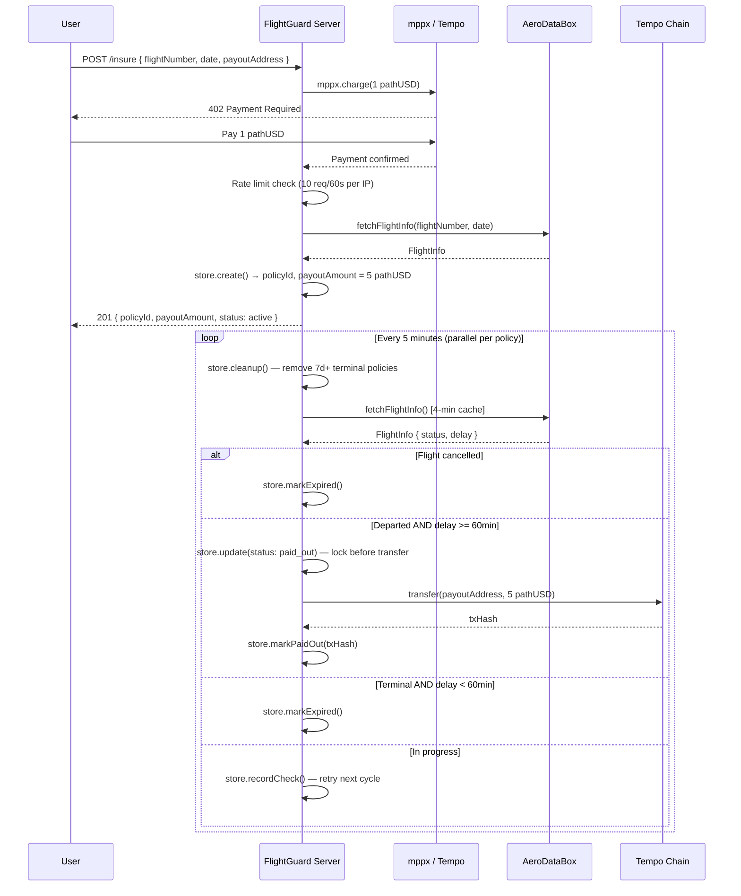

# FlightGuard MPP

**Parametric flight delay insurance on [Tempo](https://tempo.xyz) using the [Machine Payments Protocol](https://mpp.dev).**

Built by [OCTO INTELIGÊNCIA DE DADOS LTDA](https://github.com/PedroDnT) for the Tempo MPP Hackathon.

---

## What Is This?

FlightGuard eliminates the traditional insurance claims process entirely.

1. **Pay premium** via MPP (one stablecoin micropayment, ~$1)
2. **Flight is monitored** automatically every 5 minutes via AeroDataBox
3. **Payout fires automatically** if departure delay exceeds 60 minutes — no claim required

No paperwork. No adjusters. No waiting. Pure parametric: data → condition → payment.

---

## Policy Lifecycle

```
Agent/User                    FlightGuard Server              Tempo Blockchain
     |                               |                               |
     |-- POST /insure (MPP) -------->|                               |
     |   pays 1 pathUSD premium      |-- verify payment ------------>|
     |                               |<- payment confirmed ----------|
     |                               |-- fetch flight via AeroDataBox|
     |<-- { policyId, payoutAmt } ---|                               |
     |                               |                               |
     |                    [every 5 min: check flight]                |
     |                               |-- GET flight status           |
     |                               |   delay > 60min? YES          |
     |                               |-- transfer(payoutAddr, 5 USD) |
     |                               |                               |
     |<-- 5 pathUSD arrives -------->|                               |
```

### Detailed Flow



---

## Codebase Map

```
flightguard-mpp/
├── index.ts              ← Boot: loads config, starts server + checker, graceful shutdown
│
├── src/
│   ├── types.ts          ← All TypeScript types, interfaces, constants (AppConfig, Policy, FlightInfo)
│   ├── server.ts         ← Hono HTTP server: MPP-gated routes, IP rate limiter, input validation
│   ├── checker.ts        ← Cron loop: parallel flight checks, payout triggers, 7-day TTL cleanup
│   ├── flight.ts         ← AeroDataBox API wrapper + normalizer (4-min response cache)
│   ├── payout.ts         ← Tempo pathUSD transfer engine (viem ERC-20)
│   └── store.ts          ← Policy store: in-memory Map + JSON file persistence
│
├── test/
│   ├── flight.test.ts    ← Unit tests: delay helpers, departure/terminal status (14 tests)
│   └── store.test.ts     ← Unit tests: create, markPaidOut, cleanup, countByStatus (14 tests)
│
├── contracts/
│   ├── FlightGuard.sol   ← On-chain policy registry + USDC pool (optional on-chain layer)
│   └── MockERC20.sol     ← ERC-20 mock for Hardhat tests
│
├── scripts/
│   ├── deploy.js         ← Deploy FlightGuard contract to testnet/mainnet
│   └── faucet.js         ← Fund pool with testnet pathUSD (Foundry cast)
│
├── vitest.config.ts      ← Unit test config (TypeScript files only)
├── hardhat.config.js     ← Contract test + network config
└── .env.example          ← Environment variable template (12 vars)
```

### Module Dependency Graph

```
                    ┌─────────────────┐
                    │    index.ts     │
                    │  (entry point)  │
                    └────────┬────────┘
               ┌─────────────┴─────────────┐
               ▼                           ▼
        ┌─────────────┐           ┌────────────────┐
        │  server.ts  │           │  checker.ts    │
        │  HTTP + MPP │           │  cron + payout │
        └──────┬──────┘           └───────┬────────┘
               │                          │
         ┌─────┴──────────────────────────┤
         ▼                                ▼
  ┌──────────────────┐           ┌──────────────────┐
  │    flight.ts     │           │    store.ts      │
  │  ADB API + cache │           │  Map + policies  │
  └──────────┬───────┘           │    .json file    │
             │                   └──────────────────┘
             ▼                            ▲
    ┌─────────────────┐          ┌────────────────┐
    │  AeroDataBox    │          │   payout.ts    │──► Tempo Chain
    │  RapidAPI       │          │  viem ERC-20   │     (pathUSD)
    └─────────────────┘          └────────────────┘
```

---

## Setup

### 1. Prerequisites
- Node.js >= 18
- RapidAPI account (free) → [AeroDataBox API](https://rapidapi.com/aedbx-aedbx/api/aerodatabox)
- Tempo testnet wallet with pathUSD → [Faucet](https://docs.tempo.xyz/quickstart/faucet)

### 2. Install
```bash
npm install
```

### 3. Configure
```bash
cp .env.example .env
# Fill in POOL_PRIVATE_KEY, POOL_ADDRESS, RAPIDAPI_KEY
```

`POOL_ADDRESS` is the **public wallet address of the insurer pool**. In this demo, it should be the address derived from `POOL_PRIVATE_KEY` — the same wallet both **receives premiums** and **sends payouts**. You do **not** need to deploy the optional `FlightGuard.sol` contract before running the backend demo in this README.

In practice:
- `POOL_PRIVATE_KEY` = the private key of your Tempo wallet
- `POOL_ADDRESS` = the public address of that same wallet
- fund that wallet with enough `pathUSD` to cover payouts

How to get `POOL_ADDRESS`:
- If you already have the wallet in MetaMask, Rabby, or another EVM wallet, copy the wallet's **public address** and paste it into `POOL_ADDRESS`
- If you generated the wallet elsewhere, use the public address paired with the private key you put in `POOL_PRIVATE_KEY`
- `POOL_ADDRESS` must **match** `POOL_PRIVATE_KEY`; otherwise premiums may go to one wallet while payouts are attempted from another

### 4. Fund the pool
```bash
npm run faucet          # funds POOL_ADDRESS from .env with 1M pathUSD (testnet only)
```
Requires [Foundry](https://getfoundry.sh). Or fund a specific address:
```bash
npm run faucet -- 0xYourAddress
```

### 5. Start
```bash
npm start
```

---

## Demo Script

### Step 1 — Check pool is funded
```bash
curl http://localhost:3000/health
```

### Step 2 — Buy a policy (using mppx CLI)
```bash
# Install mppx CLI globally
npm i -g mppx

# Create a funded testnet account
mppx account create

# Buy insurance for a real flight
mppx http://localhost:3000/insure \
  --method POST \
  --data '{"flightNumber":"LA3251","date":"2026-03-19","payoutAddress":"0xYourWalletHere"}'
```

### Step 3 — Check your policy
```bash
curl http://localhost:3000/policy/{policyId}
```

### Step 4 — Watch the checker
Watch the terminal — every 5 minutes you'll see:
```
[CHECKER] Checking 1 active policy(ies)
[CHECKER] Checking policy abc-123...
[CHECKER]   Flight: LA3251 on 2026-03-19
[CHECKER]   Status:  Departed
[CHECKER]   Delay:   75 minutes
[CHECKER]   → Delay 75min ≥ threshold 60min — TRIGGERING PAYOUT
[PAYOUT] ✅ CONFIRMED in block 1234567
```

### Step 5 — Verify payout on explorer
`https://explore.testnet.tempo.xyz/tx/{txHash}`

---

## API Reference

### `POST /insure` — Buy a policy
**Payment required:** 1 pathUSD via MPP · **Rate limit:** 10 requests/60s per IP

**Body:**
```json
{
  "flightNumber": "LA3251",
  "date": "2026-04-01",
  "payoutAddress": "0xYourWalletAddress"
}
```

**Validation:**
- `flightNumber`: 2–8 alphanumeric characters (e.g. `LA3251`)
- `date`: `YYYY-MM-DD`, valid calendar date, not in the past
- `payoutAddress`: valid EVM address (`0x` + 40 hex chars)

**Response `201`:**
```json
{
  "policyId": "uuid-v4",
  "flightNumber": "LA3251",
  "date": "2026-04-01",
  "scheduledDeparture": "2026-04-01T10:00:00Z",
  "premium": "1.00",
  "payoutAmount": "5.00",
  "payoutAddress": "0x...",
  "status": "active",
  "message": "Policy active. Payout of 5.00 pathUSD fires automatically if departure delay exceeds 60 minutes."
}
```

### `GET /policy/:id` — Check policy status
```json
{
  "policy": {
    "id": "uuid-v4",
    "status": "active | paid_out | expired | cancelled",
    "payoutTxHash": "0x... (set when paid out)",
    "lastFlightStatus": "Departed",
    "lastCheckedAt": 1711980000000
  }
}
```

### `GET /health` — Pool stats
```json
{
  "status": "ok",
  "pool": { "address": "0x...", "balance": "999.00 pathUSD" },
  "policies": { "active": 3, "paid_out": 1, "expired": 2, "cancelled": 0 },
  "config": { "premium": "1.00 pathUSD", "payoutMultiplier": 5, "delayThresholdMin": 60 }
}
```

---

## Configuration

| Variable | Default | Description |
|---|---|---|
| `POOL_PRIVATE_KEY` | **required** | Private key for the insurer pool wallet; used to send payouts |
| `POOL_ADDRESS` | **required** | Public address of the same pool wallet; receives MPP premiums |
| `RAPIDAPI_KEY` | **required** | AeroDataBox API key |
| `TEMPO_RPC_URL` | testnet RPC | Tempo network RPC endpoint |
| `CHAIN_ID` | `42431` | Tempo chain ID (42431 = testnet, 4217 = mainnet) |
| `PATHUSD_ADDRESS` | `0x20c0...` | pathUSD token address |
| `PORT` | `3000` | HTTP server port |
| `PREMIUM_AMOUNT` | `1.00` | Policy premium in pathUSD |
| `PAYOUT_MULTIPLIER` | `5` | Payout = premium × multiplier |
| `DELAY_THRESHOLD_MIN` | `60` | Minimum delay (minutes) to trigger payout |
| `CHECK_INTERVAL_MS` | `300000` | Checker poll interval (ms) — default 5 minutes |
| `STORE_PATH` | `policies.json` | Path for persisting policies to disk |

### Do I need to deploy a contract first?

No — **not for the backend flow documented here**. The README demo works with a regular funded Tempo wallet acting as the insurer pool.

The contract in `contracts/FlightGuard.sol` is an **optional on-chain layer** for a different architecture. Only deploy it if you want to use the Solidity contract flow or extend the demo beyond the current server-managed policy model.

---

## Tests

```bash
npm test                  # Run unit tests (vitest) — 28 tests
npm run test:watch        # Watch mode
npm run test:contracts    # Run Hardhat contract tests
npm run typecheck         # TypeScript type check
```

**Unit tests** (`test/flight.test.ts`, `test/store.test.ts`):
- `getDepartureDelayMinutes` — 4 cases (no delays, with delay, empty array, undefined)
- `hasFlightDeparted` — 6 cases across all `FlightStatus` values
- `isFlightTerminal` — 7 cases across all `FlightStatus` values
- `PolicyStore.create`, `markPaidOut`, `markExpired`, `getActive`, `countByStatus`, `cleanup`

**Contract tests** (`test/FlightGuard.test.js`) — Hardhat/Chai for `FlightGuard.sol`:
- `fund()`, `registerPolicy()`, `triggerPayout()`, `expirePolicy()`, `withdraw()`

---

## Network

| Property | Testnet | Mainnet |
|---|---|---|
| Chain ID | 42431 | 4217 |
| RPC | rpc.moderato.tempo.xyz | rpc.tempo.xyz |
| Explorer | explore.testnet.tempo.xyz | explore.tempo.xyz |
| pathUSD | `0x20c000...` | `0x20c000...` |

---

## Underwriting Note

In this demo, the **pool wallet acts as the sole insurer**. The pool must be pre-funded with enough pathUSD to cover potential payouts. For production, underwriting could be:
- A DAO liquidity pool (stakers earn premium yield)
- A reinsurance API integration
- Overcollateralized stablecoin vault

---

## License
MIT — OCTO INTELIGÊNCIA DE DADOS LTDA
